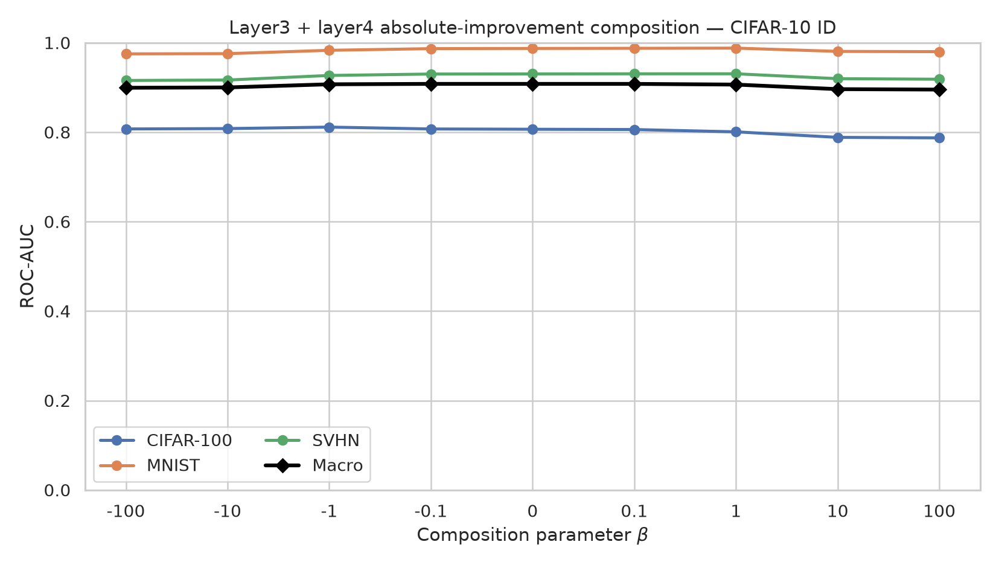
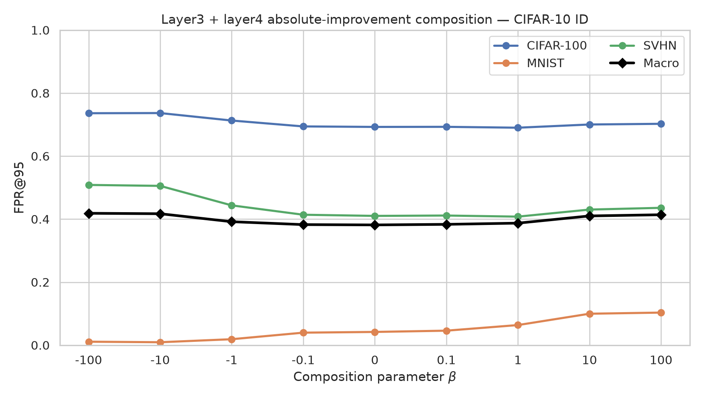
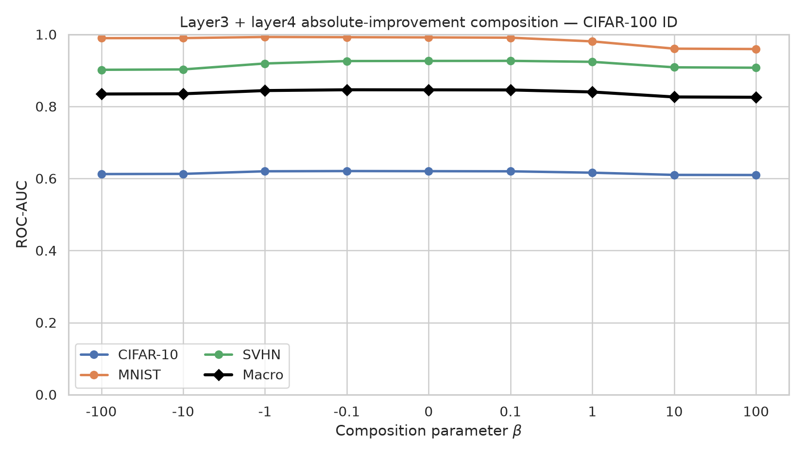
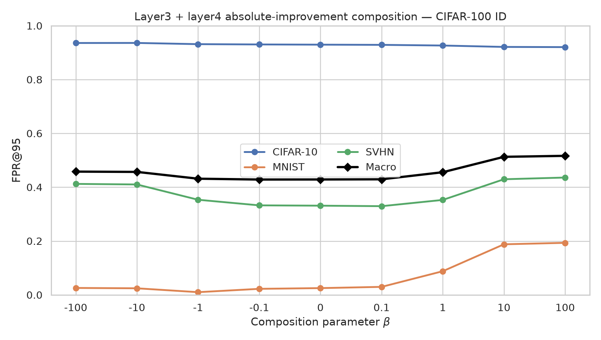

# Layer3 + Layer4 Absolute-Improvement Composition

Status: completed.

## Objective

Combine the complementary far-OOD behavior of ResNet-18 `layer3` and near-OOD behavior of `layer4` for the pixel-augmented Feature Denoising MLP students.

For each layer, the per-sample absolute-improvement score is:

```text
improvement = identity_error - raw_reconstruction_error
```

Each score is standardized using its own ID test-split population mean and standard deviation. The same statistics are then reused for all OOD datasets. Standardized layer scores are composed using the HEAT operator from [Lafon et al. (2023)](https://arxiv.org/pdf/2305.16966):

```text
combined_beta = log(exp(beta * z_layer3) + exp(beta * z_layer4)) / beta
combined_0    = (z_layer3 + z_layer4) / 2
```

The nonzero implementation uses a numerically stable log-sum-exp. Higher scores remain more ID-like.

## Setup

- Teacher: ResNet-18 trained on the corresponding ID dataset.
- Students: independently trained layer3 and layer4 MLP denoisers.
- Strategy: strong pixel-augmented embedding prediction.
- Score: absolute improvement (not relative improvement and not an absolute-value transform).
- Betas: `-100, -10, -1, -0.1, 0, 0.1, 1, 10, 100`.
- Metrics: ROC-AUC and FPR@95; macro values average the three OOD datasets.

## CIFAR-10 ID

ID test standardization statistics:

| Layer | Mean | Population std |
|---|---:|---:|
| layer3 | 0.00020035849 | 0.00012431769 |
| layer4 | 0.0049102753 | 0.0073345318 |

OOD metrics (`ROC-AUC / FPR@95`):

| Score | CIFAR-100 | MNIST | SVHN | Far macro | Overall macro |
|---|---:|---:|---:|---:|---:|
| layer3 | 0.779 / 0.805 | 0.998 / 0.000 | 0.921 / 0.349 | 0.959 / 0.174 | 0.899 / 0.384 |
| layer4 | 0.762 / 0.736 | 0.934 / 0.410 | 0.867 / 0.774 | 0.900 / 0.592 | 0.854 / 0.640 |
| beta=-100 | 0.807 / 0.736 | 0.975 / 0.011 | 0.916 / 0.509 | 0.945 / 0.260 | 0.899 / 0.419 |
| beta=-10 | 0.808 / 0.737 | 0.976 / 0.009 | 0.917 / 0.506 | 0.946 / 0.257 | 0.900 / 0.417 |
| beta=-1 | 0.811 / 0.713 | 0.983 / 0.019 | 0.927 / 0.444 | 0.955 / 0.231 | 0.907 / 0.392 |
| beta=-0.1 | 0.807 / 0.694 | 0.987 / 0.040 | 0.930 / 0.414 | 0.958 / 0.227 | 0.908 / 0.383 |
| beta=0 | 0.807 / 0.693 | 0.987 / 0.042 | 0.930 / 0.410 | 0.959 / 0.226 | 0.908 / 0.382 |
| beta=0.1 | 0.806 / 0.693 | 0.988 / 0.046 | 0.931 / 0.411 | 0.959 / 0.229 | 0.908 / 0.383 |
| beta=1 | 0.801 / 0.690 | 0.988 / 0.064 | 0.931 / 0.408 | 0.959 / 0.236 | 0.906 / 0.387 |
| beta=10 | 0.788 / 0.700 | 0.981 / 0.100 | 0.920 / 0.430 | 0.950 / 0.265 | 0.896 / 0.410 |
| beta=100 | 0.787 / 0.703 | 0.980 / 0.103 | 0.918 / 0.436 | 0.949 / 0.270 | 0.895 / 0.414 |





## CIFAR-100 ID

ID test standardization statistics:

| Layer | Mean | Population std |
|---|---:|---:|
| layer3 | 0.000125754 | 5.9736628e-05 |
| layer4 | 0.0088042923 | 0.024939515 |

OOD metrics (`ROC-AUC / FPR@95`):

| Score | CIFAR-10 | MNIST | SVHN | Far macro | Overall macro |
|---|---:|---:|---:|---:|---:|
| layer3 | 0.509 / 0.960 | 0.994 / 0.011 | 0.908 / 0.346 | 0.951 / 0.179 | 0.804 / 0.439 |
| layer4 | 0.686 / 0.908 | 0.887 / 0.565 | 0.826 / 0.779 | 0.856 / 0.672 | 0.799 / 0.751 |
| beta=-100 | 0.612 / 0.936 | 0.990 / 0.026 | 0.902 / 0.412 | 0.946 / 0.219 | 0.835 / 0.458 |
| beta=-10 | 0.613 / 0.936 | 0.990 / 0.024 | 0.903 / 0.410 | 0.946 / 0.217 | 0.835 / 0.457 |
| beta=-1 | 0.620 / 0.931 | 0.993 / 0.010 | 0.919 / 0.353 | 0.956 / 0.182 | 0.844 / 0.432 |
| beta=-0.1 | 0.621 / 0.930 | 0.992 / 0.022 | 0.926 / 0.333 | 0.959 / 0.177 | 0.846 / 0.428 |
| beta=0 | 0.620 / 0.930 | 0.992 / 0.025 | 0.926 / 0.331 | 0.959 / 0.178 | 0.846 / 0.429 |
| beta=0.1 | 0.620 / 0.929 | 0.991 / 0.030 | 0.927 / 0.330 | 0.959 / 0.180 | 0.846 / 0.429 |
| beta=1 | 0.616 / 0.926 | 0.981 / 0.088 | 0.924 / 0.353 | 0.952 / 0.220 | 0.840 / 0.456 |
| beta=10 | 0.610 / 0.921 | 0.960 / 0.188 | 0.909 / 0.430 | 0.935 / 0.309 | 0.826 / 0.513 |
| beta=100 | 0.610 / 0.920 | 0.959 / 0.193 | 0.908 / 0.436 | 0.933 / 0.315 | 0.826 / 0.517 |





## Results Summary

- **CIFAR-10**: best macro ROC-AUC uses `beta=-0.1` (0.908); best macro FPR@95 uses `beta=0` (0.382). Best Near-OOD ROC-AUC is at `beta=-1`, while best Far-OOD macro ROC-AUC is at `beta=1`.
- **CIFAR-100**: best macro ROC-AUC uses `beta=-0.1` (0.846); best macro FPR@95 uses `beta=-0.1` (0.428). Best Near-OOD ROC-AUC is at `beta=-0.1`, while best Far-OOD macro ROC-AUC is at `beta=-0.1`.

Complete machine-readable metrics and standardization statistics are stored in `reports/outputs/json/feature_denoising_layer3_layer4_absolute_improvement_composition.json`.
