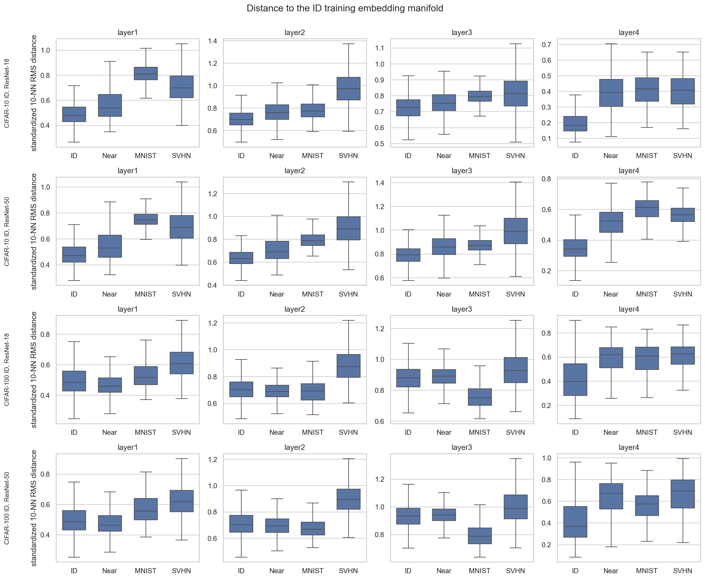

# Layerwise k-NN Neighbor-Output OOD Scores

Status: scoring implementation updated; cluster rerun required.

## Question

How well do teacher outputs inferred from a query's local ID embedding
neighborhood separate ID from OOD across the four residual stages of ResNet-18
and ResNet-50?

The first experiments use both CIFAR ID settings already present in the teacher
configs:

| ID reference | Near-OOD | Far-OOD |
| --- | --- | --- |
| CIFAR-10 train | CIFAR-100 test | MNIST test, SVHN test |
| CIFAR-100 train | CIFAR-10 test | MNIST test, SVHN test |

ID test samples are queries, not part of the reference set. Their scores
provide the ID baseline against which each OOD dataset is compared.

## Embedding Definition

Capture the outputs of `layer1`, `layer2`, `layer3`, and `layer4` during one
teacher forward pass. Apply GAP on the device before moving an activation to
CPU:

```text
activation: [batch, channels, height, width]
embedding:  mean(activation, spatial dimensions) -> [batch, channels]
```

This defines one embedding per sample and keeps the artifacts manageable. Raw
spatial activations, especially early ResNet-50 activations, are too large for
this analysis and make Euclidean distance depend on spatial alignment.

Expected embedding dimensions are:

| Teacher | layer1 | layer2 | layer3 | layer4 |
| --- | ---: | ---: | ---: | ---: |
| ResNet-18 | 64 | 128 | 256 | 512 |
| ResNet-50 | 256 | 512 | 1024 | 2048 |

## Neighbor Selection and Score Definitions

Euclidean distance between two datasets is ambiguous. Saving every pairwise
ID–OOD distance is also unnecessary: 50,000 ID training samples and 10,000 OOD
samples produce 500 million distances for one layer and one OOD dataset.

For query embedding `q` and the ID training reference embeddings `R`, select
the exact `k = 10` nearest examples. Distance is used only for this selection.
Average the selected examples' teacher probabilities and teacher logits
separately, then treat those means as the local classifier prediction.

Compute exactly seven scores from
[`docs/ood_scores/README.md`](../../docs/ood_scores/README.md): KL (teacher ||
neighbor mean), absolute maximum probability difference, absolute energy gap,
Student MSP, Student energy, predictive entropy, and BALD. The latter two treat
the selected neighbor probability distributions as a local ensemble. Save raw
metrics and sign-adjusted OOD Scores.

Calculate each quantity in two embedding spaces:

- `raw`: the unmodified GAP embedding;
- `id_standardized`: subtract the ID training mean and divide by the ID
  training standard deviation independently at each layer.

Raw and ID-standardized embeddings can select different neighbors. Fit all
normalization statistics on ID training embeddings only and compute the full
classifier score set for both selections. Higher sign-adjusted OOD Scores are
always more ID-like.

## Exact, Memory-Bounded Computation

Do not construct or save the full distance matrix. For query block `Q` and ID
reference block `R`, compute squared distances with matrix multiplication:

```text
D2 = ||Q||^2 + ||R||^2 - 2 Q R^T
```

Clamp small negative values to zero. Iterate over reference blocks and retain
only the smallest `k` values for every query. This is exact and bounds peak
memory by `query_block_size * reference_block_size`, rather than by the total
number of sample pairs. Perform the matrix multiplication on GPU when
available and store final per-sample distances as `float32` on CPU.

Start with query blocks of 1,024 and reference blocks of 8,192, then tune from
measured device memory. The same implementation must run on CPU with smaller
blocks. `torch.inference_mode()` should cover embedding extraction, and
distance computation should remain in `float32` for the reproducible baseline.

An exact FAISS flat index may be considered only if profiling shows the
PyTorch implementation is a bottleneck. It should not be the initial
dependency because blocked matrix multiplication already performs the same
exact search and keeps the implementation simple.

## Artifact Plan

Add a dedicated pooled-embedding export instead of extending the existing raw
teacher-activation export to early layers. Extract all four stages in one pass
through each dataset, GAP each batch immediately, and write bounded shards so
all layers do not accumulate in RAM.

```text
runs/embedding_distances/<id_dataset>/<teacher>/
  embeddings/
    <dataset>/<split>/<layer>/part-00000.pt
    <dataset>/<split>/<layer>/part-00001.pt
    manifest.json
  distances/
    <dataset>/<split>/<layer>.pt
    manifest.json
```

Each embedding shard contains embeddings, teacher logits, teacher
probabilities, labels, sample offsets, dataset/split, teacher identity and
revision, layer, pooling method, dtype, and preprocessing metadata. The result
artifact contains neighbor indices and distances, mean probabilities and
logits, raw metrics, and sign-adjusted OOD Scores for both embedding spaces.
Manifests record score signs, the seed, and block sizes.

Keeping embeddings separate from distances lets us add another distance or
plot without rerunning either teacher.

## Report Outputs

For every teacher, ID dataset, layer, OOD dataset, embedding space, and OOD
Score, report:

- sample count, mean, standard deviation, median, and 5/25/75/95 percentiles;
- ROC-AUC and FPR@95 using the sign-adjusted OOD Score;
- bootstrap confidence intervals for the difference between Near-OOD and each
  Far-OOD result;
- a compact ID/Near-OOD/Far-OOD distribution plot;
- the nearest ID class distribution for OOD queries.

The nearest-class distribution is important for Near-OOD: it can reveal
whether poor detection is broadly distributed or concentrated in semantic
overlap with a few ID classes.

## Implementation Order

1. Implement and test multi-layer pooled-embedding extraction.
2. Implement exact blocked top-k Euclidean selection and compare it with
   `torch.cdist` on a small tensor.
3. Validate neighbor probability/logit means and all derived scores.
4. Run ResNet-18 for both ID datasets.
5. Run ResNet-50 for both ID datasets.
6. Generate the layerwise report and use its findings to define the next
   Near-OOD experiment.

The implementation does not save full pairwise matrices or raw early-layer
feature maps. The generated results below remain from the superseded
distance-only run until the updated cluster jobs complete.

<!-- BEGIN GENERATED RESULTS -->
## Results

All four jobs completed successfully. Each result below uses the complete ID
test and OOD test sets against the complete 50,000-sample ID training
reference. Metric cells are `ROC-AUC / FPR@95`; higher ROC-AUC and lower
FPR@95 are better. Unless stated otherwise, distances are standardized using
ID-training statistics and the score is the negative mean 10-NN distance.



The figure divides standardized Euclidean distance by the square root of the
embedding dimension solely to compare magnitudes across layers. This scaling
does not change any ROC-AUC or FPR@95 result.

### Primary Layerwise Metrics

#### CIFAR-10 ID, ResNet-18

| Layer | Near: CIFAR-100 | Far: MNIST | Far: SVHN |
|---|---:|---:|---:|
| layer1 | 0.664 / 0.816 | 0.982 / 0.029 | 0.910 / 0.462 |
| layer2 | 0.692 / 0.795 | 0.743 / 0.808 | 0.948 / 0.216 |
| layer3 | 0.607 / 0.883 | 0.796 / 0.850 | 0.747 / 0.641 |
| layer4 | 0.894 / 0.517 | 0.926 / 0.460 | 0.911 / 0.497 |

#### CIFAR-10 ID, ResNet-50

| Layer | Near: CIFAR-100 | Far: MNIST | Far: SVHN |
|---|---:|---:|---:|
| layer1 | 0.656 / 0.818 | 0.973 / 0.074 | 0.904 / 0.490 |
| layer2 | 0.692 / 0.787 | 0.917 / 0.620 | 0.945 / 0.267 |
| layer3 | 0.704 / 0.790 | 0.787 / 0.837 | 0.883 / 0.386 |
| layer4 | 0.890 / 0.528 | 0.977 / 0.162 | 0.956 / 0.293 |

#### CIFAR-100 ID, ResNet-18

| Layer | Near: CIFAR-10 | Far: MNIST | Far: SVHN |
|---|---:|---:|---:|
| layer1 | 0.439 / 0.982 | 0.631 / 0.986 | 0.812 / 0.768 |
| layer2 | 0.464 / 0.982 | 0.457 / 0.994 | 0.872 / 0.548 |
| layer3 | 0.551 / 0.977 | 0.172 / 1.000 | 0.641 / 0.807 |
| layer4 | 0.771 / 0.817 | 0.779 / 0.806 | 0.814 / 0.795 |

#### CIFAR-100 ID, ResNet-50

| Layer | Near: CIFAR-10 | Far: MNIST | Far: SVHN |
|---|---:|---:|---:|
| layer1 | 0.443 / 0.979 | 0.716 / 0.903 | 0.812 / 0.774 |
| layer2 | 0.470 / 0.982 | 0.393 / 1.000 | 0.886 / 0.571 |
| layer3 | 0.535 / 0.983 | 0.139 / 1.000 | 0.668 / 0.754 |
| layer4 | 0.794 / 0.789 | 0.733 / 0.983 | 0.815 / 0.704 |

### Median Standardized 10-NN Distances

These are Euclidean distances after ID standardization, divided by
`sqrt(embedding_dimension)` for cross-layer scale comparability.

#### CIFAR-10 ID, ResNet-18

| Layer | ID | Near: CIFAR-100 | MNIST | SVHN |
|---|---:|---:|---:|---:|
| layer1 | 0.480 | 0.538 | 0.814 | 0.706 |
| layer2 | 0.704 | 0.761 | 0.774 | 0.974 |
| layer3 | 0.725 | 0.751 | 0.794 | 0.811 |
| layer4 | 0.183 | 0.398 | 0.417 | 0.406 |

#### CIFAR-10 ID, ResNet-50

| Layer | ID | Near: CIFAR-100 | MNIST | SVHN |
|---|---:|---:|---:|---:|
| layer1 | 0.471 | 0.526 | 0.747 | 0.685 |
| layer2 | 0.632 | 0.696 | 0.785 | 0.895 |
| layer3 | 0.793 | 0.855 | 0.871 | 0.981 |
| layer4 | 0.343 | 0.521 | 0.612 | 0.566 |

#### CIFAR-100 ID, ResNet-18

| Layer | ID | Near: CIFAR-10 | MNIST | SVHN |
|---|---:|---:|---:|---:|
| layer1 | 0.481 | 0.463 | 0.524 | 0.612 |
| layer2 | 0.702 | 0.691 | 0.696 | 0.876 |
| layer3 | 0.880 | 0.893 | 0.752 | 0.931 |
| layer4 | 0.403 | 0.620 | 0.606 | 0.631 |

#### CIFAR-100 ID, ResNet-50

| Layer | ID | Near: CIFAR-10 | MNIST | SVHN |
|---|---:|---:|---:|---:|
| layer1 | 0.489 | 0.470 | 0.561 | 0.618 |
| layer2 | 0.702 | 0.693 | 0.671 | 0.893 |
| layer3 | 0.933 | 0.943 | 0.791 | 0.998 |
| layer4 | 0.375 | 0.664 | 0.573 | 0.688 |

### Layer4 Near-OOD Distance Definitions

Global-centroid distance is strongly inverted: Near-OOD samples are closer
to the global ID mean than genuine ID test samples. Local neighbors and
class centroids preserve useful separation.

| Setting | 1-NN | 10-NN mean | Global centroid | Nearest class centroid |
|---|---:|---:|---:|---:|
| CIFAR-10 ID, ResNet-18 | 0.889 / 0.534 | 0.894 / 0.517 | 0.179 / 0.996 | 0.877 / 0.594 |
| CIFAR-10 ID, ResNet-50 | 0.884 / 0.530 | 0.890 / 0.528 | 0.278 / 0.990 | 0.870 / 0.583 |
| CIFAR-100 ID, ResNet-18 | 0.770 / 0.817 | 0.771 / 0.817 | 0.225 / 0.999 | 0.782 / 0.784 |
| CIFAR-100 ID, ResNet-50 | 0.798 / 0.792 | 0.794 / 0.789 | 0.354 / 0.987 | 0.788 / 0.792 |

### Raw Versus ID-Standardized Layer4 Distance

The primary local result is not an artifact of standardization. Raw and
ID-standardized 10-NN distances give nearly identical Near-OOD rankings.

| Setting | Raw | ID-standardized |
|---|---:|---:|
| CIFAR-10 ID, ResNet-18 | 0.893 / 0.528 | 0.894 / 0.517 |
| CIFAR-10 ID, ResNet-50 | 0.895 / 0.514 | 0.890 / 0.528 |
| CIFAR-100 ID, ResNet-18 | 0.771 / 0.827 | 0.771 / 0.817 |
| CIFAR-100 ID, ResNet-50 | 0.795 / 0.795 | 0.794 / 0.789 |

### Layer4 Near-OOD Penalty

Penalty signs are oriented so positive values mean Near-OOD is harder:
`Far ROC-AUC - Near ROC-AUC` and `Near FPR@95 - Far FPR@95`. Intervals
are 95% percentile intervals from 500 deterministic bootstrap draws.

| Setting | Far-OOD | ROC-AUC penalty [95% CI] | FPR penalty [95% CI] |
|---|---:|---:|---:|
| CIFAR-10 ID, ResNet-18 | MNIST | +0.032 [+0.029, +0.035] | +0.057 [+0.043, +0.073] |
| CIFAR-10 ID, ResNet-18 | SVHN | +0.017 [+0.015, +0.021] | +0.020 [+0.010, +0.033] |
| CIFAR-10 ID, ResNet-50 | MNIST | +0.087 [+0.084, +0.091] | +0.366 [+0.352, +0.379] |
| CIFAR-10 ID, ResNet-50 | SVHN | +0.067 [+0.064, +0.070] | +0.235 [+0.224, +0.247] |
| CIFAR-100 ID, ResNet-18 | MNIST | +0.009 [+0.003, +0.015] | +0.010 [-0.000, +0.020] |
| CIFAR-100 ID, ResNet-18 | SVHN | +0.043 [+0.039, +0.048] | +0.022 [+0.013, +0.032] |
| CIFAR-100 ID, ResNet-50 | MNIST | -0.061 [-0.066, -0.055] | -0.194 [-0.207, -0.179] |
| CIFAR-100 ID, ResNet-50 | SVHN | +0.021 [+0.017, +0.025] | +0.085 [+0.076, +0.094] |

### Near-OOD Nearest ID Classes at Layer4

The five most frequent nearest-neighbor ID training labels show that the
remaining overlap is semantically structured rather than uniform.

| Setting | Most frequent nearest ID classes |
|---|---:|
| CIFAR-10 ID, ResNet-18 | cat (20.5%), bird (15.8%), frog (12.3%), dog (11.0%), truck (10.3%) |
| CIFAR-10 ID, ResNet-50 | cat (20.3%), bird (15.3%), frog (12.7%), truck (11.0%), dog (10.3%) |
| CIFAR-100 ID, ResNet-18 | pickup truck (9.9%), bus (6.9%), cattle (6.4%), rabbit (4.5%), lizard (3.7%) |
| CIFAR-100 ID, ResNet-50 | pickup truck (9.9%), cattle (6.8%), bus (6.1%), kangaroo (3.8%), rabbit (3.5%) |

### Findings

- `layer4` is the only consistently strong Near-OOD layer. From `layer3`
  to `layer4`, Near-OOD ROC-AUC rises from 0.607 to 0.894 and from 0.704
  to 0.890 for CIFAR-10 ID, and from 0.551 to 0.771 and from 0.535 to
  0.794 for CIFAR-100 ID, for ResNet-18 and ResNet-50 respectively.
- Early and intermediate features do not reliably separate Near-OOD.
  With CIFAR-100 as ID, `layer1` and `layer2` are below chance and
  `layer3` is only slightly above chance.
- Good `layer4` ranking does not solve the high-recall operating point.
  Near-OOD FPR@95 is 0.517/0.528 for CIFAR-10 ID and 0.817/0.789 for
  CIFAR-100 ID with ResNet-18/50.
- ResNet-50 does not materially solve Near-OOD separation. It is similar
  to ResNet-18 for CIFAR-10 ID and improves CIFAR-100 ID `layer4` only
  modestly.
- A single global ID centroid is the wrong geometry. Its Near-OOD
  ROC-AUC is 0.179--0.354 at `layer4`, whereas local 10-NN distance is
  0.771--0.894. Near-OOD lies near the global mean but away from local
  class modes.
- Mean 10-NN and 1-NN results are close, so averaging ten neighbors adds
  robustness without hiding the signal.
- Far-OOD is representation-dependent. MNIST is strongly inverted at
  `layer3` for CIFAR-100 ID (ROC-AUC 0.172/0.139), so the semantic
  Near/Far label alone does not determine embedding distance.

### Next Experiment

Focus on `layer4` local geometry rather than global displacement. The most
direct next test is a class-conditional local score: compute k-NN distance
within the teacher-predicted ID class, then normalize it by the ID
training distribution for that class. Evaluate whether this reduces the
large CIFAR-100-ID FPR@95 while preserving the current ROC-AUC. The class
concentration above provides a concrete diagnostic for which overlaps
improve or regress.

Complete descriptive statistics for every layer, dataset, embedding space,
and distance definition are generated at
`reports/outputs/json/embedding_distance_summary.json`.
<!-- END GENERATED RESULTS -->

## Submitted Runs

| ID dataset | Teacher | Config | SLURM job | Result |
| --- | --- | --- | ---: | ---: |
| CIFAR-10 | ResNet-18 | `configs/embedding_distances/cifar_10/resnet18.yaml` | 407011 | Completed, 41 s |
| CIFAR-10 | ResNet-50 | `configs/embedding_distances/cifar_10/resnet50.yaml` | 407012 | Completed, 90 s |
| CIFAR-100 | ResNet-18 | `configs/embedding_distances/cifar_100/resnet18.yaml` | 407013 | Completed, 37 s |
| CIFAR-100 | ResNet-50 | `configs/embedding_distances/cifar_100/resnet50.yaml` | 407014 | Completed, 88 s |

All jobs exited with code `0:0` and produced the expected 16 distance
artifacts and 116 pooled-embedding shards.
